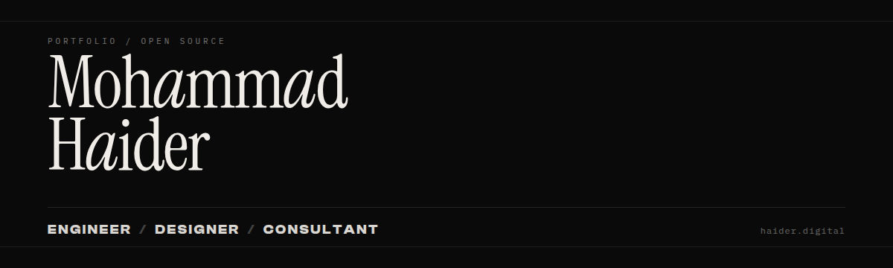

  

  
  
  

### Intro

**Mohammad Haider.** Engineer, designer, consultant. Enterprise sales engineering at Whatfix. Builds interactive products, demos, and open source tools.

[haider.digital](https://haider.digital) · [linkedin.com/in/heza](https://www.linkedin.com/in/heza/) · mohammadhaider325@gmail.com

### Focus

| Area | Details |
|------|---------|
| **Enterprise solutioning** | Technical discovery, POCs, demos, integrations across banking, CRM, and SaaS |
| **Product engineering** | React, Tauri, Go CLIs, browser extensions, MCP and agent tooling |
| **AI workflows** | LLM features, RAG experiments, transcript-to-ticket automation |

### Featured work

**GitHub For the Love of Code 2025** ([winners](https://github.blog/open-source/from-karaoke-terminals-to-ai-resumes-the-winners-of-githubs-for-the-love-of-code-challenge/))  
Contest entries: [Tuneminal](https://github.com/heza-ru/Tuneminal) (terminal karaoke, Go), [Netstalgia](https://github.com/heza-ru/Netstalgia) ([live](https://netstalgia.netlify.app/), 90s web), [GitGrill](https://github.com/heza-ru/GitGrill) (profile roast engine). Tuneminal and Netstalgia placed in *Terminal Talent* and *World Wide Wonders*.

**[Disactivity](https://github.com/heza-ru/Disactivity)** · Tauri 2 + React  
Desktop game-activity simulator. Highest-star public original on this account.

**[TeamFlow-MCP](https://github.com/heza-ru/TeamFlow-MCP)** · TypeScript  
MCP server for Jira, Confluence, and Productboard.

**[Privasea](https://github.com/heza-ru/Privasea)** · Go  
Local-first privacy toolkit for broker opt-outs, exposure scanning, and evidence tracking.

**[enable](https://github.com/heza-ru/enable)** · TypeScript · [demo](https://enable-xi.vercel.app)  
Client-side Claude assistant with local storage and cost tracking.

### Open source

[FULU Foundation](https://github.com/FULU-Foundation) / [CRW-Extension](https://github.com/FULU-Foundation/CRW-Extension) (~958★): top human contributor. Merged [#161](https://github.com/FULU-Foundation/CRW-Extension/pull/161), [#164](https://github.com/FULU-Foundation/CRW-Extension/pull/164).

### Recognition

- **GitHub For the Love of Code 2025**: global challenge winner (Tuneminal, Netstalgia)
- **WhatFX Top Contributor (Best Sales Engineer), North America**: 2025; 2026 Q1 and Q2
- Led technical solutioning on WhatFX largest SMB deal ($200K+) and largest enterprise deal ($1M+)
- Secured $4M+ ARR; 40%+ POC conversion; adoption cycles cut up to 70%

### Stack

  

`TypeScript` · `React` · `Next.js` · `Node.js` · `Go` · `Python` · `Tauri` · `SQL` · REST / webhooks · Salesforce · Workday

### Activity

<!-- Official github-readme-stats / activity-graph Vercel apps are paused/disabled; use working mirrors. -->

  
  

  

### Connect

| | |
|---|---|
| **Site** | [haider.digital](https://haider.digital) |
| **LinkedIn** | [linkedin.com/in/heza](https://www.linkedin.com/in/heza/) |
| **Email** | mohammadhaider325@gmail.com |
| **GitHub** | [github.com/heza-ru](https://github.com/heza-ru) |
