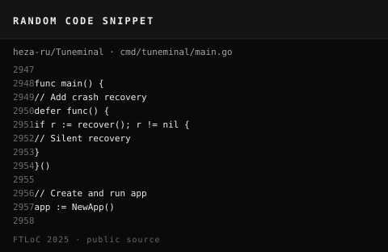
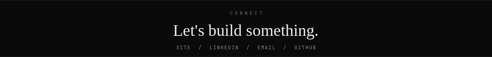

  

  
  

Enterprise Sales Engineer with 3+ years of experience in AI-enabled SaaS, digital adoption, and enterprise solution engineering. Leads technical discovery, solution design, tailored demonstrations, and proofs of concept for diverse stakeholder groups, aligning integrations and adoption strategies with business needs. Secured $4M+ in new ARR, achieved a POC conversion rate of over 40%, and delivered solutions that reduced onboarding or adoption cycles by up to 70%.

[haider.digital](https://haider.digital) · [linkedin.com/in/heza](https://www.linkedin.com/in/heza/) · mohammadhaider325@gmail.com

### Focus

| Area | Details |
|------|---------|
| **Enterprise solutioning** | Technical discovery, POCs, demos, integrations across banking, CRM, and SaaS |
| **Product engineering** | React, Tauri, Go CLIs, browser extensions, MCP and agent tooling |
| **AI workflows** | LLM features, RAG experiments, transcript-to-ticket automation |

### Recent Works

**GitHub For the Love of Code 2025** ([winners](https://github.blog/open-source/from-karaoke-terminals-to-ai-resumes-the-winners-of-githubs-for-the-love-of-code-challenge/))  
Contest entries: [Tuneminal](https://github.com/heza-ru/Tuneminal) (terminal karaoke, Go), [Netstalgia](https://github.com/heza-ru/Netstalgia) ([live](https://netstalgia.netlify.app/), 90s web), [GitGrill](https://github.com/heza-ru/GitGrill) (profile roast engine). Tuneminal and Netstalgia placed in *Terminal Talent* and *World Wide Wonders*.

**[Disactivity](https://github.com/heza-ru/Disactivity)** · Tauri 2 + React  
Desktop game-activity simulator.

**[TeamFlow-MCP](https://github.com/heza-ru/TeamFlow-MCP)** · TypeScript  
MCP server for Jira, Confluence, and Productboard.

**[Privasea](https://github.com/heza-ru/Privasea)** · Go  
Local-first privacy toolkit for broker opt-outs, exposure scanning, and evidence tracking.

**[enable](https://github.com/heza-ru/enable)** · TypeScript · [demo](https://enable-xi.vercel.app)  
Client-side Claude assistant with local storage and cost tracking.

### Open source

[FULU Foundation](https://github.com/FULU-Foundation) / [CRW-Extension](https://github.com/FULU-Foundation/CRW-Extension) (~958★): top human contributor. Merged [#161](https://github.com/FULU-Foundation/CRW-Extension/pull/161), [#164](https://github.com/FULU-Foundation/CRW-Extension/pull/164).

### Recognition

- **GitHub For the Love of Code 2025**: global challenge winner (Tuneminal, Netstalgia)
- **Whatfix Top Contributor (Best Sales Engineer), North America**: 2025; 2026 Q1 and Q2

### Stack

`TypeScript` · `React` · `Next.js` · `Node.js` · `Go` · `Python` · `Tauri` · `SQL`

### Activity

<table width="100%">
  <tr>
    <td width="50%" valign="top">
      
    </td>
    <td width="50%" valign="top">
      
    </td>
  </tr>
  <tr>
    <td width="50%" valign="top">
      
    </td>
    <td width="50%" valign="top">
      
    </td>
  </tr>
  <tr>
    <td width="50%" valign="top">
      
    </td>
    <td width="50%" valign="top">
      
    </td>
  </tr>
</table>

### Connect

  

  
  
  
  

